# Portrait Previews

Here are some mobile portrait screenshots of the application:

### Profile Views

  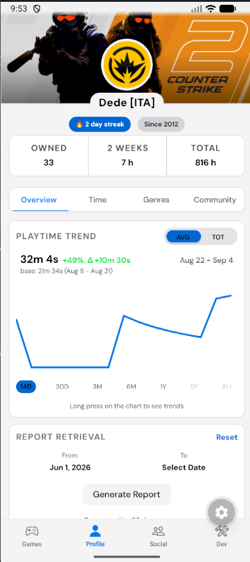
  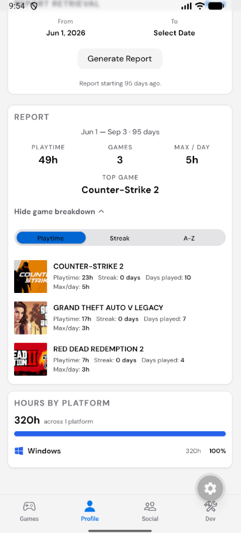
  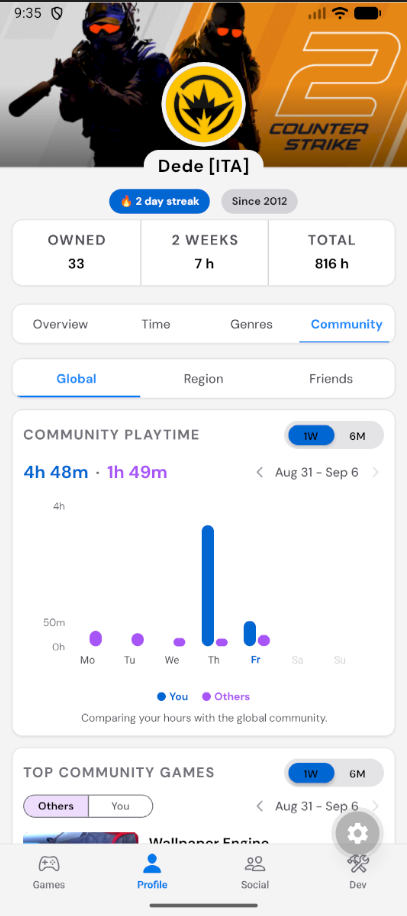
  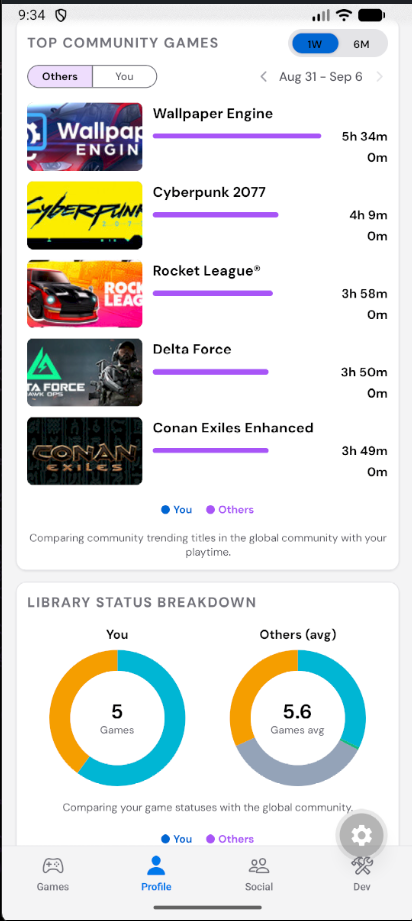

  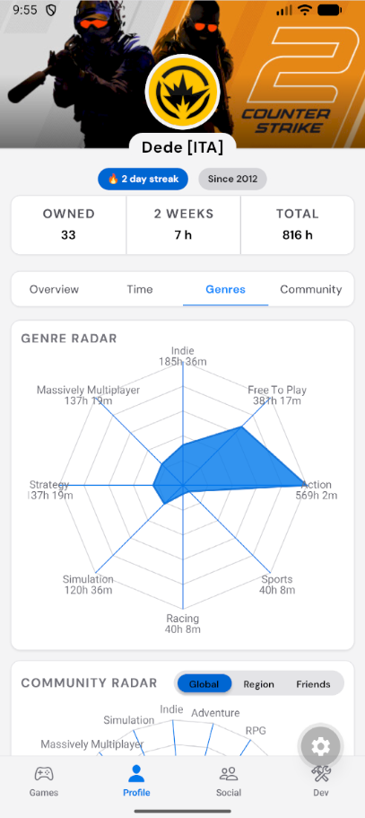
  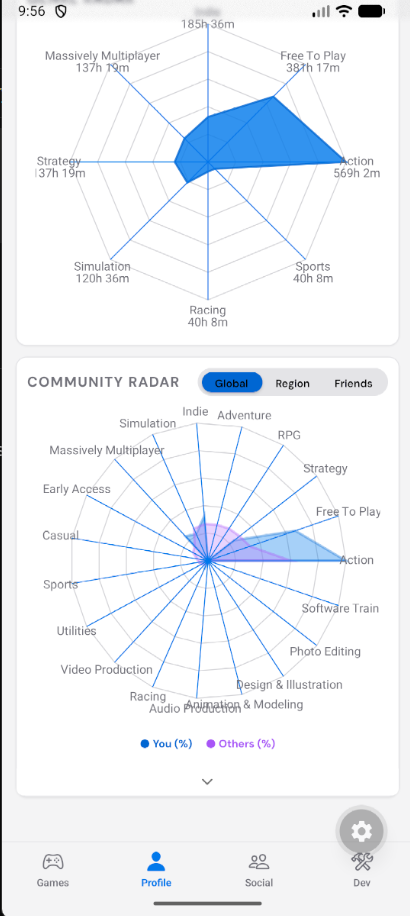
  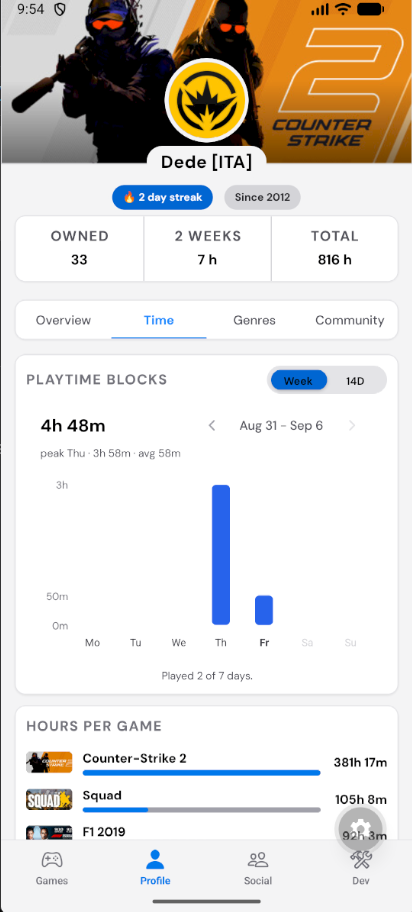
  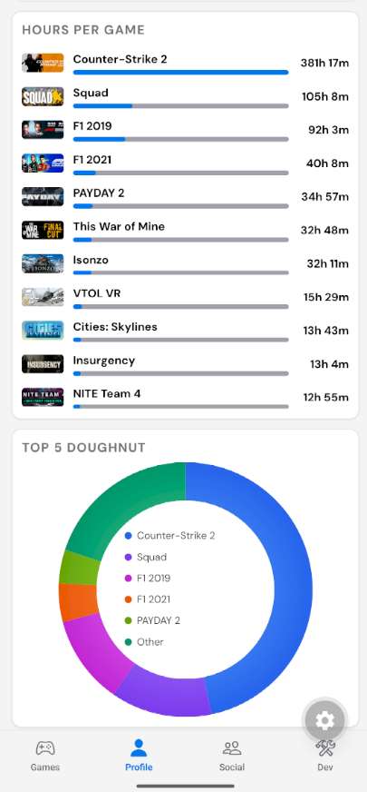

### Game & List Views

  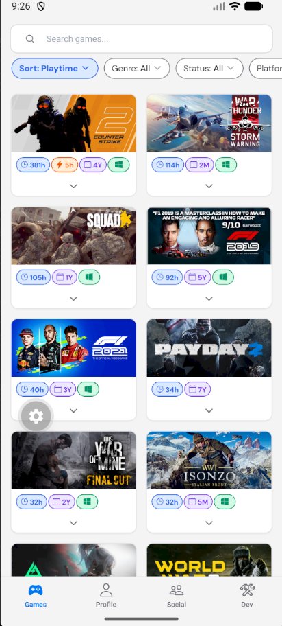
  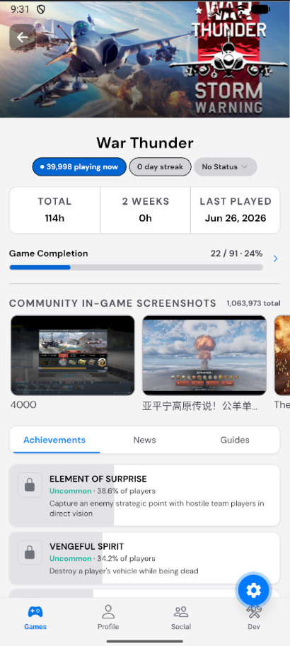
  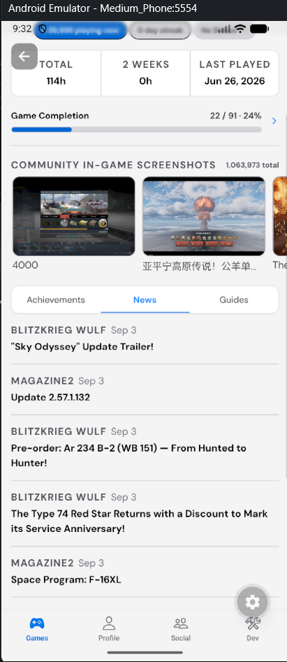
  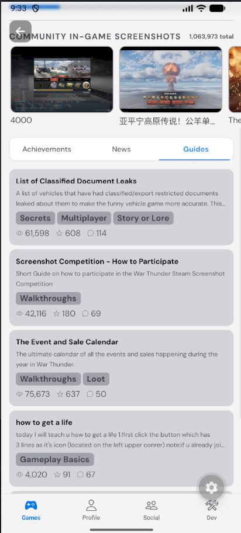

### Other Profiles & Social

  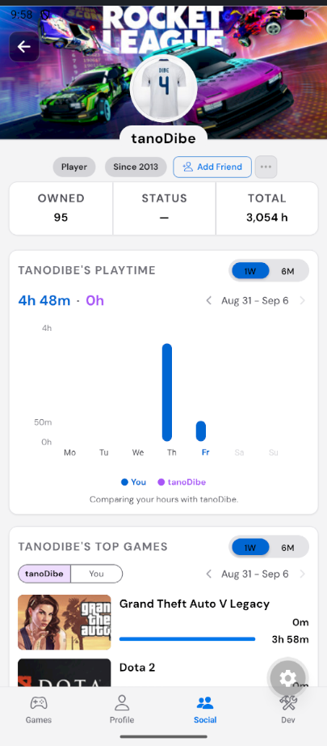
  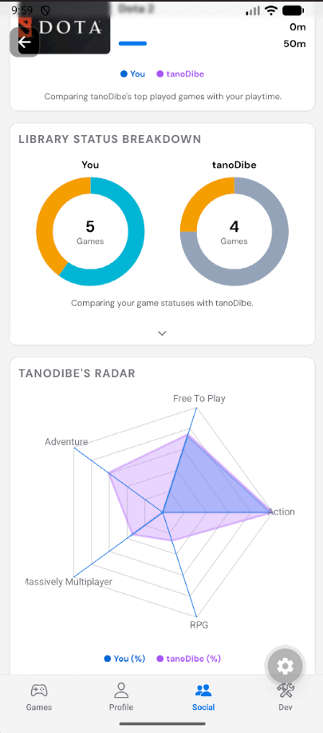
  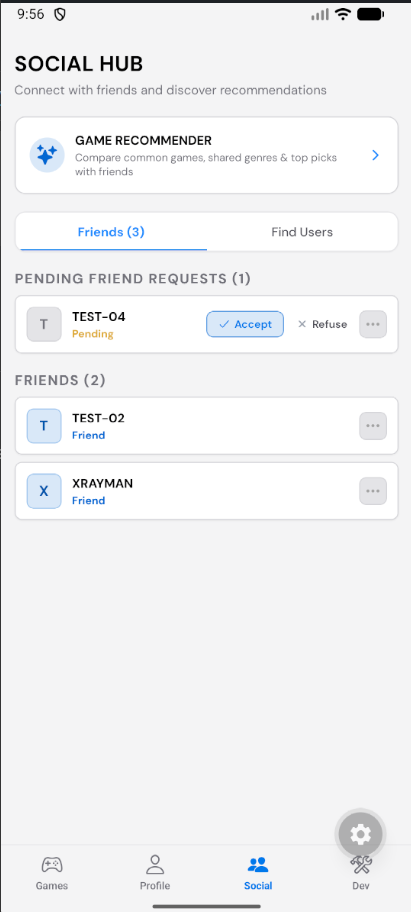
  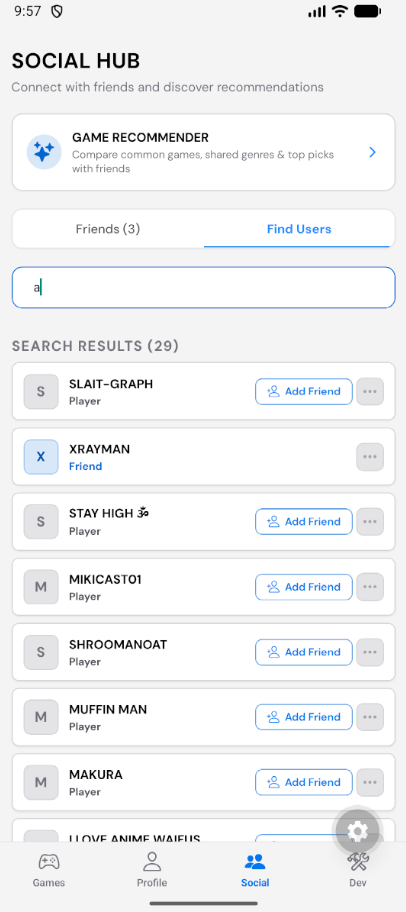

