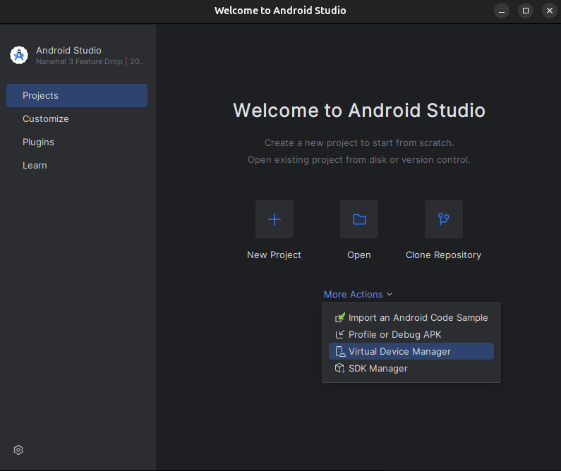

# Project Settings

## Starting the project

### expo go on android emulator

1. open android studio
2. click on virtual device manager and start the VM 

3. run: `npm run start`
4. check the current expo mode is Expo Go (in blue)
5. press "a" in the terminal to open the app in the android emulator
   - shift + a to select the emulator if you have more than one
6. if you have problems with the metro bundler, try to reset the cache with `npm run start -c`

### expo go - development build on android emulator

1. open android studio
2. click on virtual device manager and start the VM
3. run: `npm run android`
4. if the emulator doesn't open automatically, press "a" in the terminal to open the app in the android emulator
   - shift + a to select the emulator if you have more than one

note: use java 17

## Minimal Workflow

before committing:

```zsh
npm run lint:fix
npm run prettier:fix
```

## Useful stuff

### Linter

to check for linting:

```zsh
npm run lint
```

to fix linting problems:

```zsh
npm run lint:fix
```

settings for ESLint in `eslint.config.js`.

### Jest

to run every test (with coverage):

```zsh
npm run test
```

settings for jest in `package.json`, under "jest".

### Prettier

if you need to just check for prettier formatting:

```zsh
npm run prettier
```

if you want to automatically fix every formatting error:

```zsh
npm run prettier:fix
```

settings for prettier in `.prettierrc`.

### Note

Every command in this document is to be run inside the mobile-app folder.

## Environment Variables (.env)

Create your local environment file from the example:

```zsh
cp .env.example .env
```

Set these variables in `.env`:

- `EXPO_PUBLIC_BACKEND_BASE_URL`: backend base URL used by backend provider (example: `http://192.168.1.11:8000` for Waydroid/device, `http://localhost:8000` for web).
- `EXPO_PUBLIC_FIREBASE_API_KEY`: Firebase client API key.
- `EXPO_PUBLIC_FIREBASE_AUTH_DOMAIN`: Firebase auth domain.
- `EXPO_PUBLIC_FIREBASE_PROJECT_ID`: Firebase project id.
- `EXPO_PUBLIC_FIREBASE_STORAGE_BUCKET`: Firebase storage bucket.
- `EXPO_PUBLIC_FIREBASE_MESSAGING_SENDER_ID`: Firebase messaging sender id.
- `EXPO_PUBLIC_FIREBASE_APP_ID`: Firebase app id.
- `EXPO_PUBLIC_FIREBASE_MEASUREMENT_ID` (optional): Firebase measurement id.
- `EXPO_PUBLIC_TOKEN_GEN_EMAIL`: test Firebase user email used by the Dev View token generator.
- `EXPO_PUBLIC_TOKEN_GEN_PASSWORD`: password for the test Firebase user.

After changing any `EXPO_PUBLIC_*` variable, stop Expo and start it again.

The Firebase token flow works like this:

1. Start the backend and the Expo app.
2. Open the Dev View in the app.
3. Press **Generate Firebase Token** to log in as the test user. The session token is stored automatically via `AsyncStorage`.
4. Press **Test Backend Auth**. The component automatically reads the active session token and sends it in the `Authorization: Bearer <token>` header to `GET /me`.

The auth test component reads the backend endpoint from `src/api-manager/apiEndsPoints.ts` and sends the token using the `Authorization: Bearer <token>` header.

## API Provider Switch

Use these scripts to choose the backend implementation:

```zsh
npm run start:steam
npm run start:backend
```

```zsh
npm run android:steam
npm run android:backend
```

If you need to override the backend URL:

```zsh
EXPO_PUBLIC_BACKEND_BASE_URL=http://localhost:9000 npm run start:backend
```

For Android emulators/devices (including Waydroid), use your host LAN IP instead of `localhost`.
Example:

```zsh
EXPO_PUBLIC_BACKEND_BASE_URL=http://192.168.1.11:8000 npm run android:backend
```

Note: if Expo is already running, stop and restart it after changing `EXPO_PUBLIC_BACKEND_BASE_URL`.


## Dev View auth tools

The Dev View contains two auth-related helpers:

- `FirebaseTokenGenerator`: signs in with the test Firebase user and prints the ID token to the console.
- `BackendTestAuth`: calls the protected backend endpoint directly and shows `ok` or `unauthorized`.

Both components are for local testing only.
